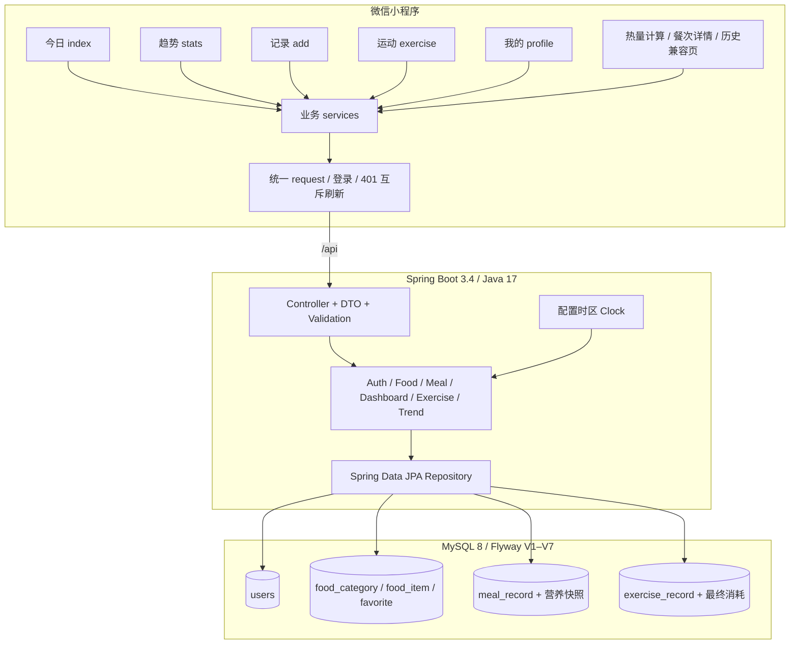
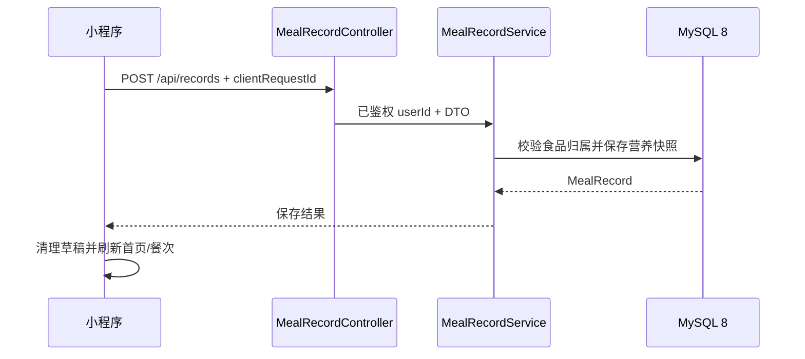
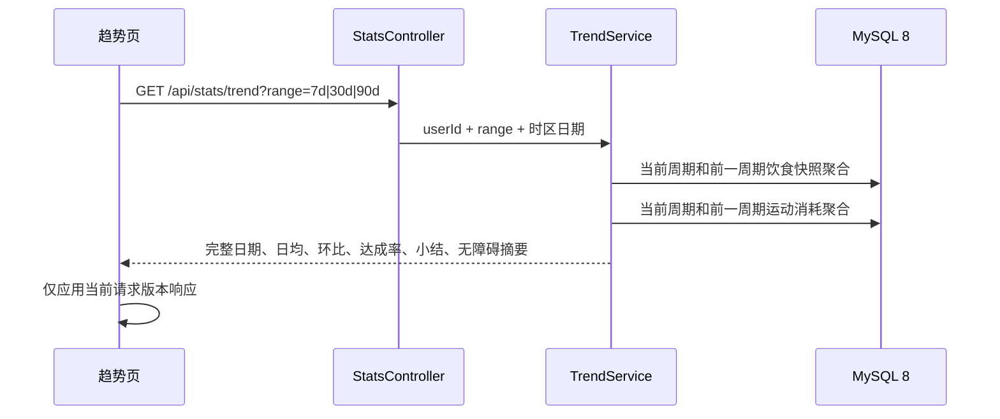

# 系统架构设计

> 本文描述 M8 分支的当前架构。开发阶段、质量门禁和防复发规则分别见 [`DEVELOPMENT.md`](./DEVELOPMENT.md) 与 [`DEVELOPMENT-RETROSPECTIVE.md`](./DEVELOPMENT-RETROSPECTIVE.md)。

## 1. 整体架构



## 2. 运行时与环境

| 项目 | 基线 |
| --- | --- |
| 后端 | Java 17、Spring Boot 3.4.4、Maven Wrapper |
| 数据库 | MySQL 8，Flyway 管理结构；测试使用 H2 MySQL 兼容模式并由 CI 补充真实 MySQL 8 验证 |
| 小程序开发 | 微信开发者工具只导入 `miniapp/` |
| 开发 API | `http://127.0.0.1:8080/api` |
| 体验/正式 API | `miniapp/shared/config.js` 按 `envVersion` 选择 |
| 统计时区 | `APP_TIME_ZONE`，默认 `Asia/Shanghai` |

项目和 CI 的权威 Java 版本是 17。本机默认 Java 更高时，必须显式设置 `JAVA_HOME`，否则 Mockito/Byte Buddy 可能在测试插桩阶段失败。

## 3. 小程序信息架构

一级导航固定为五项：

| Tab | 页面 | 职责 |
| --- | --- | --- |
| 今日 | `pages/index` | 目标、摄入、运动、营养、餐次摘要 |
| 趋势 | `pages/stats` | 7/30/90 天摄入、运动、净摄入和规则小结 |
| 记录 | `pages/add` | 食品搜索、常用/最近/收藏、自定义与拍照占位 |
| 运动 | `pages/exercise` | 运动 CRUD、消耗估算与规则推荐 |
| 我的 | `pages/profile` | 资料、头像和手动热量目标；M10 继续补齐隐私与设置 |

二级能力：

- `packageFood/pages/calorie-calculator`：份量和营养实时预览。
- `packageFood/pages/meal-detail`：餐次明细编辑和删除。
- `packageFood/pages/calendar`：一次加载整月摘要，展示记录标记和选中日餐次。
- `pages/history`：旧历史页仅保留兼容，新入口已由饮食日历替代。
- `packageTools/pages/design-system`：开发期组件预览。

页面不直接调用 `wx.request`，统一经过 `services/` 和 `services/request.js`。异步页面分别维护加载、成功、空、错误和重试状态；快速切换查询条件时用请求版本号忽略过期响应。

## 4. 后端分层

当前代码仍按技术层目录组织：

```text
controller/ → service/ → repository/ → entity/
       │          │
       └── dto/   └── api/ 统一异常
```

主要边界：

- Controller 只处理鉴权上下文、参数 DTO 和 HTTP 映射。
- Service 定义业务规则、聚合口径、用户隔离和事务。
- Repository 只负责按用户和日期查询；趋势和月历聚合使用数据库分组查询。
- Entity 不直接作为写接口请求体。
- 所有用户 ID 取自鉴权过滤器写入的请求属性，不接受客户端自报用户 ID。

随着 M9/M10 增长，可在不改变接口契约的前提下逐步按 `meal/`、`exercise/`、`stats/`、`user/` 业务包重组，但不为重构延误阶段闭环。

## 5. 核心数据规则

### 5.1 食品与饮食记录

- 重量类食品的营养基准统一为每 100g。
- 按份食品使用 `baseAmount=1` 和原单位。
- `meal_record` 保存名称、基准量、单位和四项营养快照。
- 历史首页、明细和趋势都基于快照计算，食品库后续修改不会重写历史统计。
- 写入使用 `client_request_id` 做用户内幂等保护。

### 5.2 运动记录

- 服务端根据类型、时长和强度估算消耗。
- 用户可按设备数据修正，`exercise_record.calories_burned` 保存最终确认值。
- 首页剩余可摄入仍按饮食目标计算；运动只影响净摄入，不自动“返还”可吃额度。

### 5.3 趋势统计

```text
每日净摄入 = 饮食摄入快照聚合 - 运动最终消耗聚合
日均值 = 完整日期区间总量 / 区间天数
```

- 支持 7、30、90 天，缺失日期补 0。
- 结束日期由配置时区的 `Clock` 决定，测试使用固定时钟。
- 环比使用前一等长周期；前一周期净摄入为 0 时不返回百分比。
- 少于 3 个有数据日期只提示继续记录，达到 3 天后最多返回两条规则化总结。
- 首页同日摄入、运动和净摄入必须与趋势最后一天对账一致。

### 5.4 饮食日历

- 月份仅接受严格 `yyyy-MM` 格式，并限制在当前月及向前 11 个月。
- 整月饮食和运动分别使用一条按日分组查询，空日由服务层补 0，不逐日请求。
- `remainingCalories` 只按摄入与目标计算；运动消耗不返还可摄入额度。
- 餐次数是当天已记录的不同餐次类型数，仅运动记录也会让 `hasRecord=true`。

## 6. 数据库与迁移

| 版本 | 主要内容 |
| --- | --- |
| V1–V3 | 用户、食品、饮食基础结构与资料字段 |
| V4 | 食品发现、收藏和营养基准 |
| V5 | 饮食快照与幂等键 |
| V6 | 系统食品基线 |
| V7 | 运动记录与用户/日期索引 |

空库由 Flyway 顺序执行。旧 MySQL 8 数据库必须按 [`mysql8-data-migration.md`](./mysql8-data-migration.md) 备份、接管和验证，不能清库或手工改 `flyway_schema_history`。本地备份位于被忽略的 `backend/var/`，不得提交或上传。

## 7. 关键请求流程

### 7.1 饮食保存



### 7.2 趋势查询



## 8. 质量门禁

提交前必须同时通过：

1. Java 17 下后端测试。
2. `node --test miniapp/tests/*.test.js` 全量小程序测试。
3. 全部 JS/JSON 静态检查和 `git diff --check`。
4. 微信开发者工具普通编译问题面板为 0。
5. 相关页面真实成功态联调与设计稿对照。
6. API、架构、里程碑和数据迁移文档同步。

CI、联调、视觉验收、PR 合并和阶段标签是不同证据，不能互相替代。
