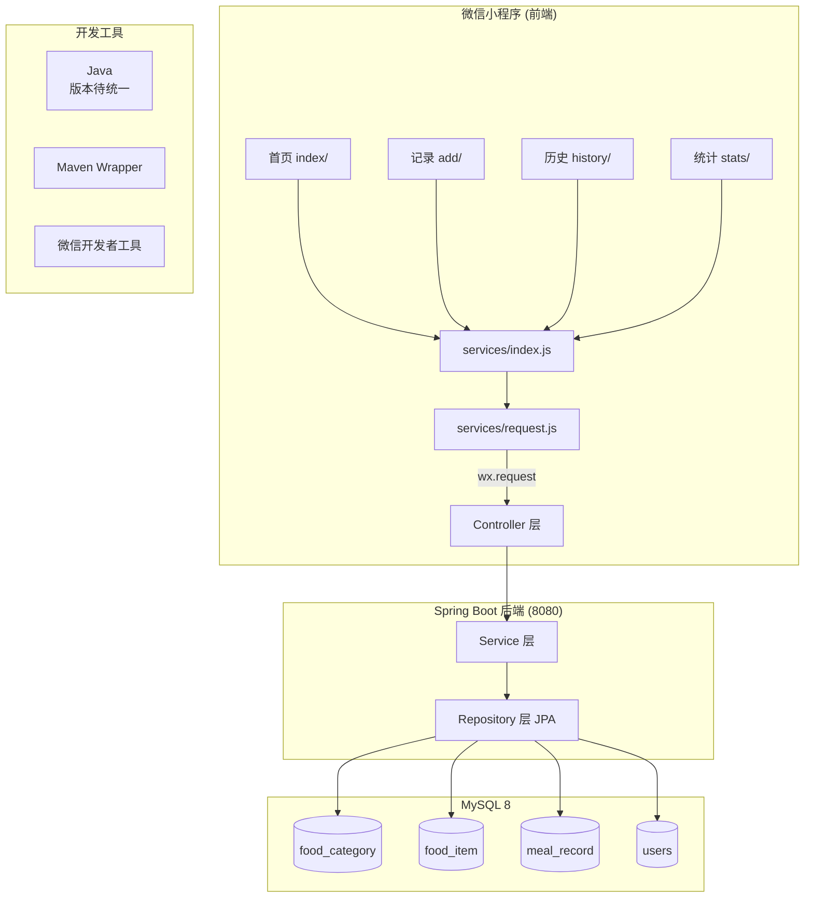

# 系统架构设计

> 本文记录当前原型结构。优化版目标架构、开发阶段和质量要求以 [`DEVELOPMENT.md`](./DEVELOPMENT.md) 为准。

## 整体架构



## 分层架构

```
┌──────────────────────────────────────────────────────┐
│                   CONTROLLER 层                       │
│  ┌──────────────────┐  ┌────────────────────────┐    │
│  │ FoodController    │  │ MealRecordController    │    │
│  │ • GET /categories │  │ • POST/GET /records    │    │
│  │ • GET/POST /foods │  │ • DELETE /records/{id} │    │
│  │ • GET /foods/search│  │ • GET /stats/daily     │    │
│  │                   │  │ • GET /stats/weekly    │    │
│  └────────┬─────────┘  └───────────┬────────────┘    │
└───────────┼─────────────────────────┼────────────────┘
            │                         │
┌───────────▼─────────────────────────▼────────────────┐
│                   SERVICE 层                          │
│  ┌──────────────────────────────────────────────┐    │
│  │           MealRecordService                   │    │
│  │  • 分类/食物查询     • 饮食记录 CRUD          │    │
│  │  • 自定义食物创建    • 日/周统计计算          │    │
│  │  • 营养数据聚合                                │    │
│  └──────────────────────┬───────────────────────┘    │
└─────────────────────────┼────────────────────────────┘
                          │
┌─────────────────────────▼────────────────────────────┐
│                   REPOSITORY 层                       │
│  ┌──────────────┐ ┌──────────────┐ ┌──────────────┐  │
│  │FoodCategory  │ │ FoodItem     │ │ MealRecord   │  │
│  │Repository    │ │ Repository   │ │ Repository   │  │
│  └──────┬───────┘ └──────┬───────┘ └──────┬───────┘  │
└─────────┼────────────────┼────────────────┼──────────┘
          │                │                │
┌─────────▼────────────────▼────────────────▼──────────┐
│                    ENTITY 层 (JPA Entity)              │
│  ┌────────────────┐  ┌────────────────────────┐       │
│  │ FoodCategory   │──│ FoodItem               │       │
│  │ • id           │  │ • id, name, unit       │       │
│  │ • name, icon   │  │ • calories/protein/    │       │
│  │ • sortOrder    │  │   fat/carbs            │       │
│  └────────────────┘  └────────┬───────────────┘       │
│                               │ 1:N                   │
│  ┌────────────────────────────▼────────────────┐      │
│  │ MealRecord                                   │      │
│  │ • id, mealDate, mealType(enum)               │      │
│  │ • quantity, unit, note, recordTime           │      │
│  └──────────────────────────────────────────────┘      │
└────────────────────────────────────────────────────────┘
```

## 数据流

### 记录饮食流程
```
用户选择/输入食物
       │
       ▼
  前端校验 → 调用 wx.request()
       │
       ▼
  POST /api/records  (JSON)
       │
       ▼
  Controller 接收请求
       │
       ▼
  Service 解析 foodItem.id → 加载 FoodItem 实体
       │
       ▼
  Repository 保存 MealRecord 到 MySQL 8
       │
       ▼
  返回完整 MealRecord (含 FoodItem 关联)
       │
       ▼
  前端展示成功提示 → 跳转首页
```

### 自定义食物 + 记录流程
```
用户输入食物名称、营养数据
       │
       ▼
  ① POST /api/foods (创建食物条目)
       │
       ▼
  返回 FoodItem (含 id)
       │
       ▼
  ② POST /api/records (用新食物的 id)
       │
       ▼
  创建完成，跳转首页
```

### 统计计算流程
```
日统计: 同一天所有记录 → 遍历计算 热量/蛋白质/脂肪/碳水 总和
周统计: 本周一到周日 → 按日期分组计算每日热量 → 返回 7 天数据
```

## API 数据流转

```
请求: → Controller (@RequestBody / @RequestParam)
        → Service (业务逻辑、数据聚合)
        → Repository (JPA 查询)
        → Entity (Hibernate 映射)
        → MySQL 8

响应: → MySQL 8
        → Entity + Hibernate 关联加载
        → JSON 序列化 (Jackson)
        → HTTP Response
```

## 小程序页面路由

```
TabBar 导航:
┌─────────┬─────────┬─────────┬─────────┐
│  首页    │  记录    │  历史    │  统计    │
│ index/  │  add/   │ history/│ stats/  │
└─────────┴─────────┴─────────┴─────────┘
     │         │         │         │
     │   提交成功跳转      │         │
     └────────┘         └─────────┘
```

## 部署拓扑

```
┌────────────┐    局域网/公网穿透    ┌────────────┐
│  手机      │ ←────────────────── │  开发机     │
│ 微信小程序  │    wx.request       │ ┌────────┐ │
│            │                      │ │ 后端    │ │
│            │                      │ │ :8080  │ │
│            │                      │ ├────────┤ │
│            │                      │ │MySQL 8 │ │
│            │                      │ │ :3306  │ │
└────────────┘                      │ └────────┘ │
                                    └────────────┘
```

## 代码结构依赖关系

```
controller/  →  service/  →  repository/  →  entity/
    │               │             │
    │          ┌────┘             │
    │          │                  │
    └──────────┴──────────────────┘
          Spring DI 注入

FoodController       → MealRecordService → FoodCategoryRepository
                     → MealRecordService → FoodItemRepository
MealRecordController → MealRecordService → MealRecordRepository
                     → MealRecordService → FoodItemRepository
                     → MealRecordService → FoodCategoryRepository
```
